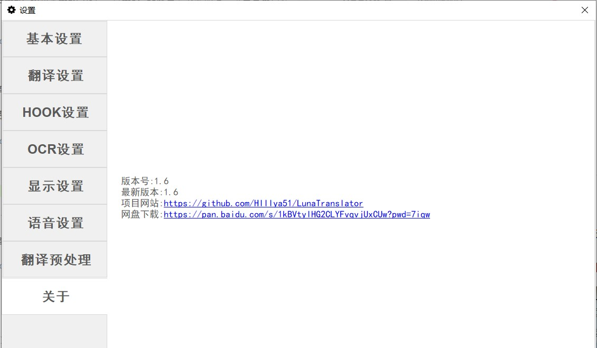
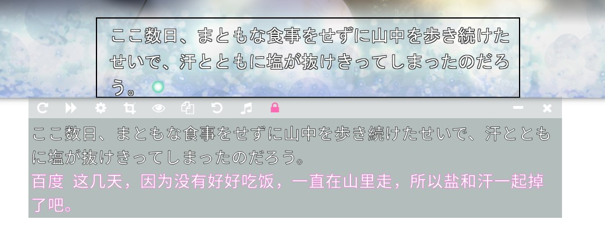
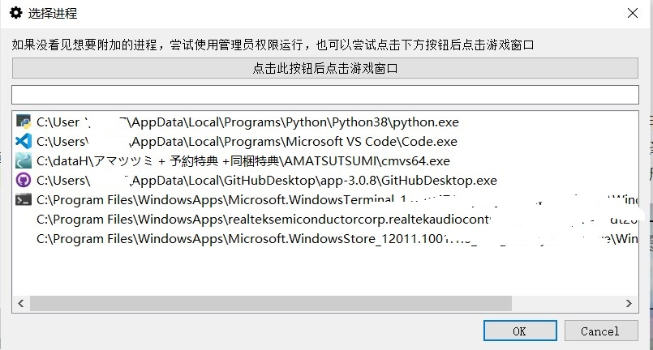
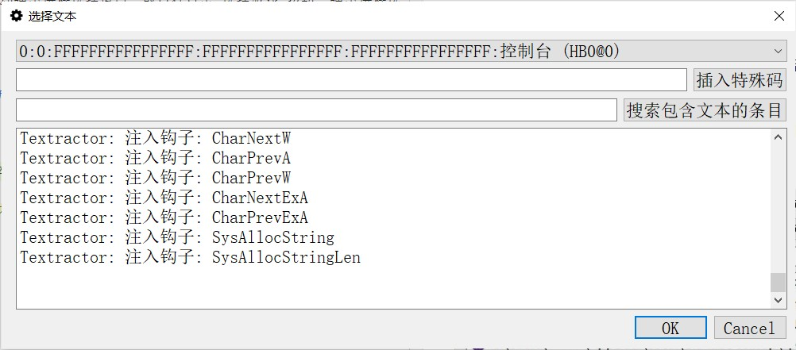
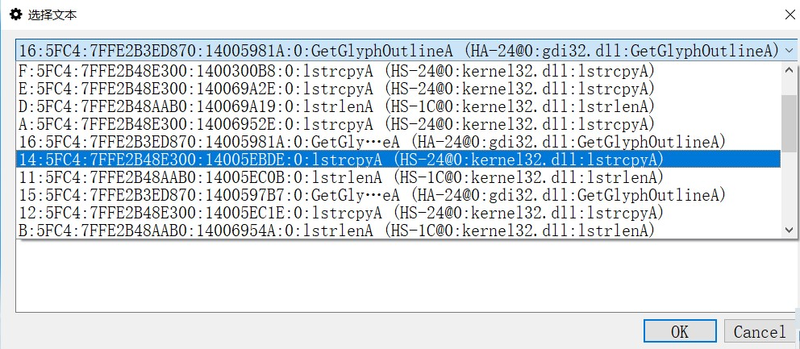
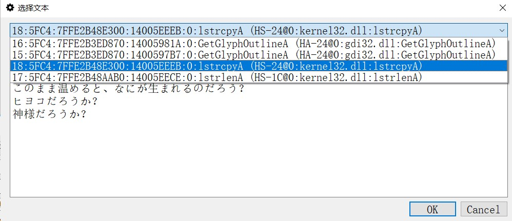
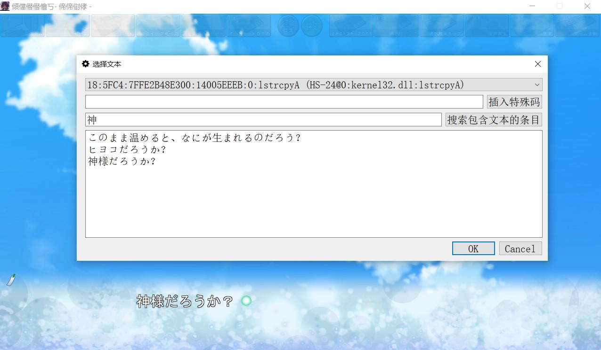
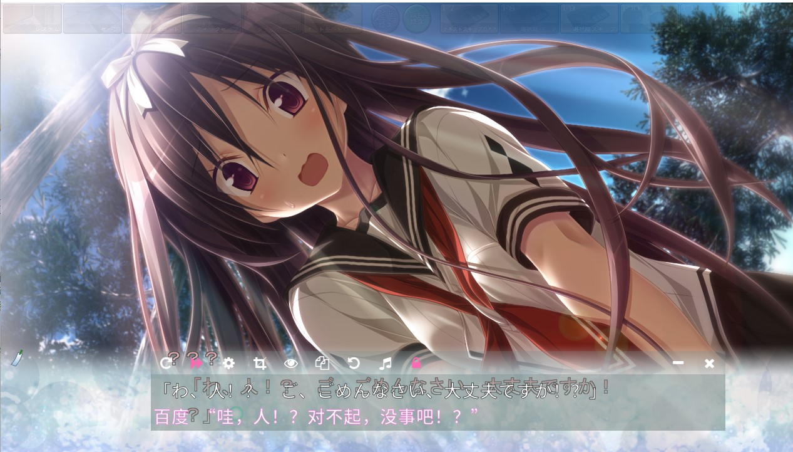

 

##### 关于

软件的一些基本信息

### OCR说明

软件自带OCR，不需要任何部署。使用时先在基本设置中选择OCR，然后在工具栏中选择选取OCR范围，然后即可进行自动识别翻译。
可以拖到和调整黑色范围框，或者重新选取来改变OCR范围。可以按下隐藏按钮隐藏范围框

### HOOK说明

可以选择使用Textractor（HOOK）进行文本的提取，方法如下：

在基本设置界面选择Textractor，会自动弹出进程选择窗口。或自行点击“选择游戏”按钮，弹出进程选择窗口。

有两种方式选择进程：

* 点击“点此按钮后点击游戏窗口”按钮后，点击游戏窗口，会自动获取游戏进程

* 在下方的列表中选择游戏

 进程选择窗口

选择完毕后点击OK，然后会自动弹出文本选择窗口。

 文本选择窗口

刚出现此窗口时，最上方的下来列表中还没有想要的条目。
在游戏里面让游戏显示下一句话，最上方的下拉列表中就会出现很多很多条目。

  

选取条目后，文本选择窗口中的文本框就会显示这一条目捕捉到的文本。
列表中会有很多条目，可以在下拉列表中滚动鼠标滚轮快速切换条目来寻找所需要的条目，或者在下方的“搜索包含文本的条目”文本框中输入当前游戏窗口中的文字对条目进行筛选，就可以轻松找到所需的内容。

使用游戏中出现的“神”字进行搜索，列表中只剩下4个条目。

 

 

然后选择OK，游戏就会开始翻译。如果后面发现选择的条目不符合要求，还可以自己在基本设置界面打卡选择文本按钮重新进行选择。

 

<!-- 

 -->