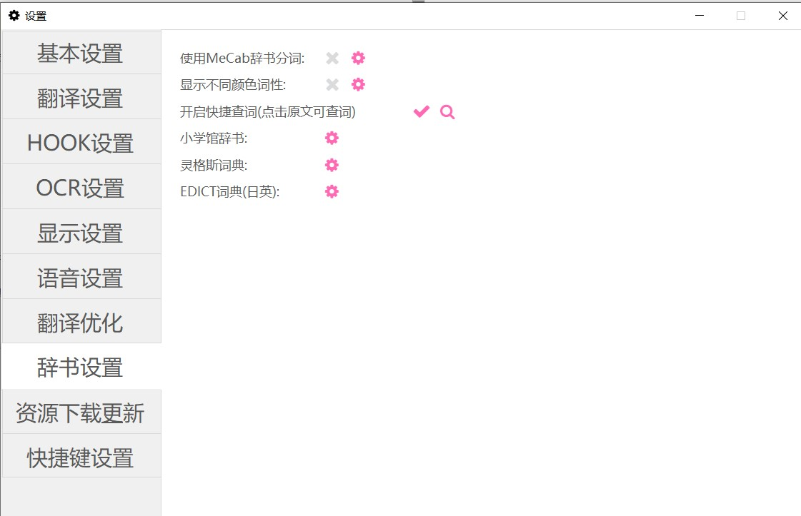
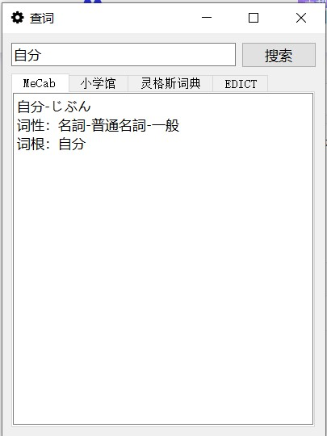
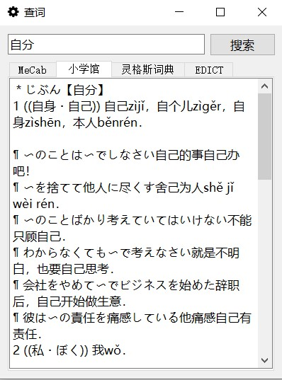

 

# 辞书设置

如果设置了辞书，本软件可以帮助用户学习日语。
设置使用mecab分词并在显示设置中设置显示分词结果，可以显示出分词词结果；
设置使用mecab分词并在显示设置中设置显示假名，可以显示出汉字的假名；

（若不使用mecab，则会使用系统内置的简单分词器，也可以显示假名和分词结果，但是不能区分词性）

设置使用mecab分词并设置显示不同颜色词性，则可以将不同词性的单词用不同颜色标注出来。

开启快捷查词后，点击翻译窗口的原文，会弹出查词窗口。

