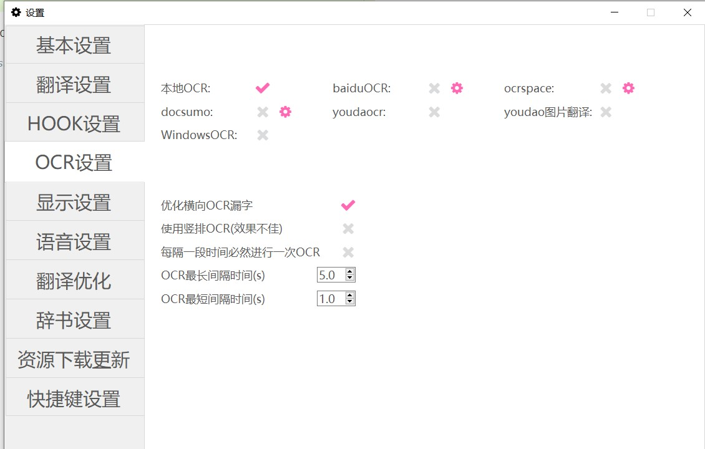

 
# OCR设置

在OCR模式下，可以选择使用的OCR源

其中本地OCR是内置的OCR引擎，可以无脑用。

百度OCR/ocrspace/docsumo需要设置密钥。

youdaoocr和youdao图片翻译是体验性接口，容易抽风。

WindowsOCR需要操作系统中安装日语相关组件。

设置“每隔一段时间必然进行一次OCR”后，设置OCR最长间隔时间，则每个x秒必然进行一个OCR，不管图片是否改变。

