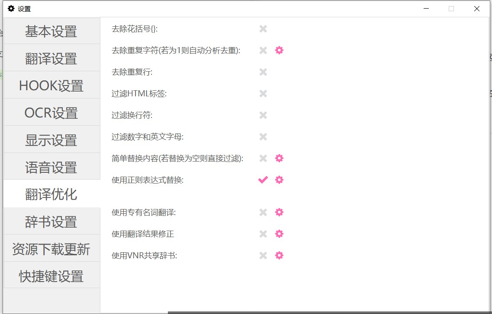

 

# 翻译优化

对于HOOK提取到的文本，有时会有一些不好的内容，这里可以设置对文本进行一些简单的处理操作

其中包括一些常见的设置以及一些高级设置。

使用简单替换内容可以将提取到的文本进行替换/过滤

使用正则表达式替换需要用户了解python的reg.sub的使用方法

使用专有名词手动翻译选项，支持使用用户配置的特殊名词词典（例如一些人名地名等）来优化翻译

翻译结果修正发生在翻译结束后，名词翻译对于有的翻译引擎容易失效，可以强制替换翻译结果。

本软件部分支持使用VNR共享辞书

如果用户了解python语言，可以直接在LunaTranslator\LunaTranslator\postprocess\post.py文件中直接进行修改即可实现用户想要的任何处理过程。

