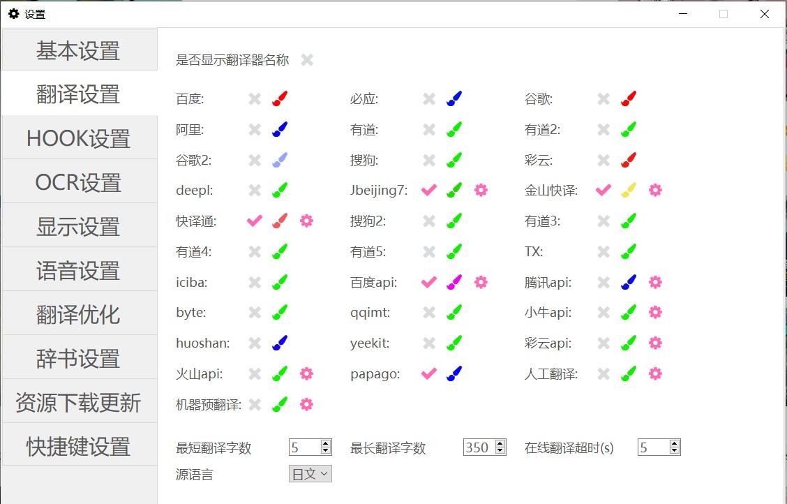

# 翻译设置 

一些翻译器的设置。不过作者比较懒就没有把各种类型的翻译器分开放。

支持几乎所有能想得到的翻译引擎，包括：

&emsp;&emsp;**离线翻译** 支持使用J北京7、金山快译、译典通进行离线翻译 

&emsp;&emsp;**免费在线翻译** 支持使用百度、必应、谷歌、阿里、有道、彩云、搜狗、DeepL、金山、讯飞、腾讯、字节、火山、papago、yeekit进行翻译

&emsp;&emsp;**注册在线翻译** 支持使用用户注册的百度、腾讯、有道、小牛、彩云、火山翻译密钥翻译

&emsp;&emsp;**预翻译** 支持读取人工翻译和聚合机器预翻译文件 

所有翻译器均可随意选择，没有数量限制。

按钮分别是：是否使用翻译器/设置翻译文本显示颜色/设置

其中，离线翻译&注册在线翻译&预翻译需要在使用前点击设置按钮进行设置。

